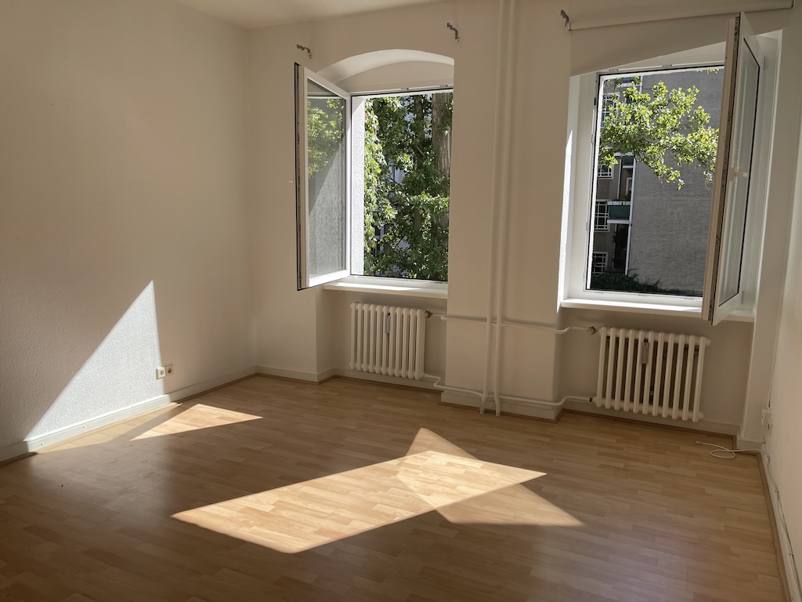
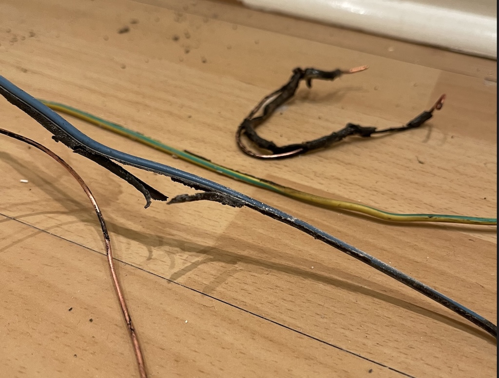
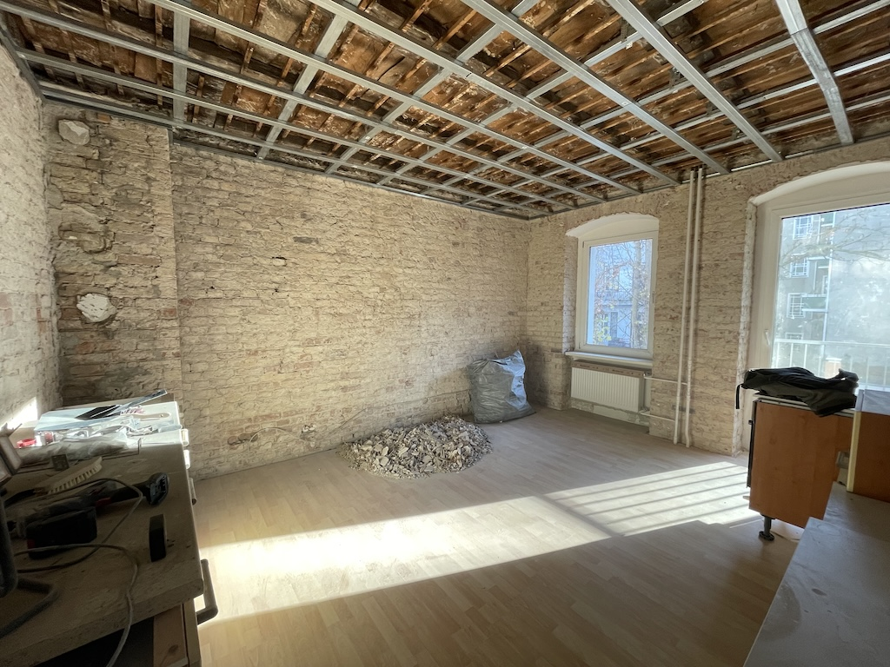

In 2023 my partner and I were lucky enough to buy an apartment in Berlin.

I say lucky. What I _mean_ is that it was a deeply adult decision that I'm grateful we both could make. But my god, it was financially and emotionally stressful.

Nonetheless, we now have a 90m2 apartment in a neighbourhood that was, if not quite fashionable, was certainly nice.

## Chekov's Lightbulb

Post-puchase we made some modification plans. This meant the swapping of the bathroom and kitchen - the apartment having a tiny kitchen and a huge bathroom, the layouts of which really didn't work for us.

After receiving the keys I went to our new home with the intention of performing some light prep work. Cleaning up, removing any junk left behind, fitting lights, etc.

I was there by myself fitting a wall socket onto one of the dangling electrical connections when I discovered something interesting: this apartment came with the special feature of, when live and neutral are shorted (as I accidentally caused to happen while fitting a light socket) the overload breakers don't trip.

If you know anything of electrics, this is quite bad.

The first indication of this a loud bang, and smoke pouring out of the main electrical panel.

Kids, get an electric survey done on old Berlin apartments, I beg you.

Despite the bowel-loosening developments I had the presence of mind to flip a nearby switch and disconnect the short. That's what caused this to become an amusing anecdote, rather than a news item.

The emergency electricians come over quite quickly in retrospect, considering it was a Sunday evening. After safing everything they tested the apartment electrics. Unsurprisingly their recommendation was replace all the wiring in the apartment if we wanted to be safe.

I mean, just look at the wiring that had been used in the consumer unit. Completely undersized and now melted. Now imagine what was hiding behind all the walls. :sob:

Apparently this situation is quite common in Berlin apartments. After the Wall fell the city became a landlord paradise. They purchased apartments by the tens of thousands and set them up as rental units. Unsurprisingly these opportunistic property developers didn't have "electrical standards", "longevity", or, indeed, "basic safety" as part of their core mission statement. Instead they hired the lowest-bidding Russians, dizzy on Glasnost and Perestroika, to come over to do everything on the cheap.

So, there we were. We had an apartment that needed massive work to get the electrical system up to 21st century standards. We still had our original plan to swap the bathroom and the kitchen. And, at a very shallow level, the place needed an intense makeover - both aesthetically, and becuase it had been occupied by an elderly Polish couple for 30 years and they had left a certain smell embedded deep into the very plaster of the walls.

So we decided to completly gut the place.

## Swings and Roundabouts

When I say "gut it", I don't mean "remove the wallpaper and rip up the carpets". No, I mean we decided to take everything back to the brick and pull down the ceilings.

Problem was that we didn't have any, as the kids say, liquid assets at this point.

Thankfully we hadn't yet cancelled our rental contract. So, at weekends, and the occasional weekday evening, we left our rental place to go at the new purchase with jackhammers and crowbars.

It took over a year.

It was backbreaking work, and drove us both mad with exhaustion. But we did it, shifting tonnes of rubble in the process. (FYI Ikea blue bags are simply superb for carrying rubble down stairs and into a skip).

Professionals later told us we had saved about €90,000 by doing it ourselves. This is lovely, as we barely had the dosh to pay the bills while we were doing all this.

So, it's 2025 and we've finally got past the brutal demolition work and we've started building things. We now have suspended metal profile ceilings, and bare brick walls, and modern electrical wiring. We're getting in pros to fit the bathroom in the next few weeks. We're actually feeling like we might - dare I even think it - one day move in.

## Smarts

So naturally this is the point where I can start obsessing over nerd shit.

This is a golden opportunity for a freak like me. Every wall is bare. The ceilings are open. I can run cables wherever I want. I can drill holes in walls. I can install sensors, and network drops, and access points, and I can do it all in a way that doesn't require ripping things apart while I'm living in there.

This spring I started installing low-voltage cabling - alarms, networking, and audio/visual. I've got a location for the network rack planned. It's all coming together.

I'm hoping to write about it as I go. Keep an eye on the [#homeautomation](/tags/homeautomation) tag to follow along.
